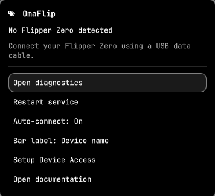

# OmaFlip

Native Flipper Zero management for the Omarchy Quattro bar: USB discovery,
remote screen, files, CLI, apps, backups, firmware, and Dev.



## Install

```sh
omarchy plugin add https://github.com/HowieDuhzit/OmaFlip.git --enable
```

The plugin ships QML plus a native `omaflip` backend. After adding it, build
once (nothing runs as root):

```sh
cd ~/.config/omarchy/plugins/io.github.howieduhzit.omaflip
./scripts/build
```

Then choose **Restart service** in the panel. Arch build packages:
`base-devel cmake qt6-base qt6-declarative systemd protobuf`.

The development installer copies a local checkout into the plugin directory and
**refuses to overwrite** an existing install:

```sh
./scripts/build
./scripts/install-dev
```

## Usage

Connect a Flipper Zero with a USB data cable. Click **OmaFlip** in the bar.
Escape closes the panel. Open Remote, Files, CLI, Apps, Backup, or Dev from
the connected panel. Those views hold the serial port only while open.

```sh
omarchy-shell shell summon io.github.howieduhzit.omaflip '{}'
omarchy-shell shell hide io.github.howieduhzit.omaflip
```

## Configure

```sh
omarchy bar move io.github.howieduhzit.omaflip --section right
```

Auto-connect, bar label, notify-on-connect, and notify-on-error persist in the
widget's Omarchy settings. They do not rewrite unrelated `shell.json` keys.

## Remove

```sh
omarchy plugin remove io.github.howieduhzit.omaflip --yes
```

Omarchy removes the plugin checkout and its bar entry. Optional leftovers:

```sh
rm -f ~/.local/lib/omaflip/omaflip
sudo rm -f /etc/udev/rules.d/70-omaflip.rules
sudo udevadm control --reload-rules
```

No firmware or Flipper files are changed.

## Features

- One native QML bar widget and keyboard-operated panel inside Omarchy's existing shell.
- One C++20 backend per user, owned by the plugin's service lifecycle.
- Startup discovery and libudev USB/TTY events; no device polling or idle timer.
- Flipper USB descriptor recognition, including firmware-customized product names,
  and `/dev/serial/by-id/` resolution.
- Multiple-device inventory and explicit device selection, remembered by USB identity.
- Separate disconnected, detecting, connecting, connected, busy, error, and bootloader states.
- Device name, firmware version/origin, hardware revision, USB serial, region,
  battery level, charging state, battery health, RPC protobuf version, and
  SD storage totals when firmware provides them.
- On-demand remote: 128×64 screen stream, directional/OK/Back input, mouse
  click/drag/wheel on the screen, PNG
  screenshot save/copy/history. The serial port is released when Remote closes.
- On-demand files: SD browse, text previews, download/upload with progress,
  drop destination review, mkdir/rename/delete, overwrite confirmation.
- On-demand CLI: firmware `help` command list, history, output filter, save,
  reconnect, bounded scrollback, and `log` streaming stopped with Ctrl+C.
- On-demand Apps: `/ext/apps` inventory, .fap launch/install/remove, JS
  edit/save/run through firmware JS Runner. No catalog client.
- On-demand Backup: `/int` archives with sidecar metadata, restore
  compatibility checks, official or Momentum firmware index + SHA-256
  download, confirmed SD updater apply. Asset packs install under
  `/ext/asset_packs`; activation is on-device. DFU flashing is not enabled.
- On-demand Dev: `ufbt` create/build/lint/SDK update, FAP deploy/run, and a
  read-only RPC inspector. `ufbt` is not bundled; GPIO/flash stay off.
- Clear permission/serial errors, Retry, Copy error, and bounded diagnostics.
- Native theme colors, fonts, spacing, panel transitions, and Escape dismissal.
- Desktop notifications for connect, disconnect, and errors (`device.added` /
  `device.removed` / `device.error`), with panel toggles. Probe and ping times
  in device details. Packaged tarball via `scripts/package`.
- Offline operation. No telemetry or automatic network requests. Firmware
  indexes are fetched only on an explicit Check.

Information is read at attachment and on **Refresh / Retry**. The serial port is
released after every query. **Last read (UTC)** identifies the snapshot; battery
and storage readings are not continuously refreshed. Missing fields show **Unavailable**.
Each refresh starts a short RPC session after the CLI reads, then releases the port.
Remote, Files, CLI, Apps, and Backup each hold the port only while that view is open.

## Requirements

- Omarchy with the Quattro plugin API (developed and tested on **4.0.4**).
- Linux with libudev and an active local logind session for `uaccess` permissions.
- Qt 6.6+ Core and Gui; Qt Test for the development tests.
- C++20 compiler, CMake 3.25+, pkg-config; `qmllint` for UI validation.
- A Flipper Zero and a USB data cable for device acceptance.

Arch packages: `base-devel cmake qt6-base qt6-declarative systemd protobuf`.
Python is used for development process tests only. Runtime does not require
Python, Qt SerialPort, Electron, a web server, or a second Quickshell instance.

The plugin manifest has no build hook; adding the repository does not compile
`omaflip`. **Build / repair backend** in the panel opens `scripts/build` if the
binary is missing. See [development](docs/development.md) for iteration.

## Permissions / udev

If the device is present but inaccessible, the panel reports **Permission
denied**, including the actual port and suggested fix. Choose **Setup Device
Access**, review the prompt, and authenticate in the terminal. This installs
only `udev/70-omaflip.rules` and reloads udev rules. Unplug/reconnect afterward.

The rule grants the active local user access to the exact Flipper serial
descriptors. It does not make devices world-writable, add arbitrary groups, or
run the shell as root. Non-seat/headless sessions need their administrator's
device-access policy. DFU write permissions are deliberately not installed in
this release.

The optional udev rule is installed only when you choose **Setup Device Access**
and authenticate. Duplicate USB serials are never used to collapse devices.

## Firmware support

**Official firmware:** the foundation uses the upstream `device_info` and
`info power` CLI commands. Unsupported power commands leave power unavailable
without discarding valid device information. A firmware without a working CLI
is reported explicitly; USB presence does not prove a successful connection.

**Momentum:** USB recognition and CLI fields use the same foundation. Firmware
origin is shown exactly as reported; it is not guessed from a device name.
Updates use `https://up.momentum-fw.dev/firmware/directory.json` (release and
development). Asset packs use the documented `/ext/asset_packs` path and the
Momentum pack index; they are selected in Momentum Settings on the Flipper.
OmaFlip does not write Momentum settings files.

**Bootloader:** `0483:df11` is a shared STM32 DFU identity. OmaFlip lists it as
**STM32 DFU · identity unconfirmed**, never as a proven Flipper. It does not
flash, claim a serial-to-DFU identity mapping, or open arbitrary STM32 devices.

## Developer Mode and FAP workflow

The foundation's diagnostics expose actual USB and firmware fields without a
mock layer. Dev uses upstream `ufbt` when it is on PATH (`pipx install ufbt` on Arch).
Deploy is OmaFlip RPC, not `ufbt flash`. See [roadmap](docs/roadmap.md).

## Troubleshooting

| Status | Action |
| --- | --- |
| No Flipper detected | Check the cable and USB mode; run `build/omaflip --scan` from the checkout. |
| Detecting | USB is present but a serial interface may not be ready, or auto-connect is off. |
| Permission denied | Install the supplied rule, then physically reconnect. |
| Busy | Close qFlipper or another serial client and Retry. |
| CLI timeout | Unlock/check firmware USB CLI support, close other clients, reconnect and Retry. |
| Service unavailable | Build the backend and Restart service; Open diagnostics shows stderr. |
| STM32 DFU | Confirm the device physically. This preview provides no recovery/flashing operation. |
| Third-party replacement bar | Omarchy intentionally withholds service lookup from widgets hosted by replacement bars; the trusted built-in bar is required. |

Diagnostics are bounded to 16 KiB and kept in memory. Device serials and paths
are shown locally; redact them before sharing bug reports. Another OmaFlip
backend cannot run concurrently in the same user session. Disabling/removing
the plugin closes its backend and any active serial transaction.

## Architecture and validation

[Architecture and IPC](docs/architecture.md) · [upstream research](docs/research.md)
· [validation record](docs/validation.md) · [contributing](CONTRIBUTING.md)

```sh
cmake -S . -B build -DBUILD_TESTING=ON
cmake --build build --parallel 2
ctest --test-dir build --output-on-failure
python tests/test_ipc.py
omarchy plugin validate .
qmllint -I /usr/share/omarchy/shell BarWidget.qml Panel.qml Service.qml qml/*.qml
```

Unit tests use explicit pseudoterminal fixtures, isolated from production.
Hardware tests are a separate acceptance checklist. There is no runtime mock
switch and no generated fallback device information.

## License

MIT. OmaFlip is an independent project, not an official Flipper Devices or
Omarchy product. Upstream projects retain their respective licenses; no
upstream firmware/qFlipper source or generated protobuf bindings are vendored.
