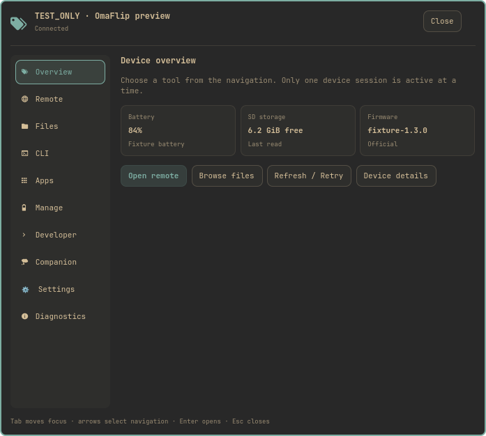
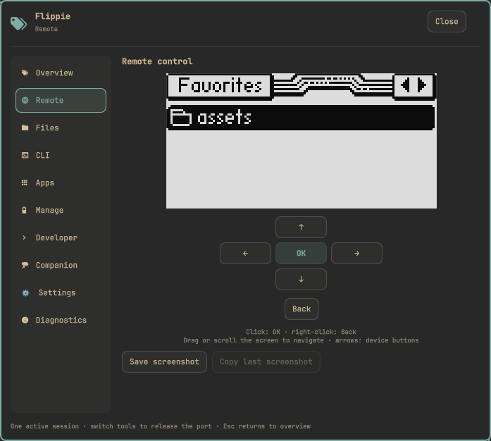
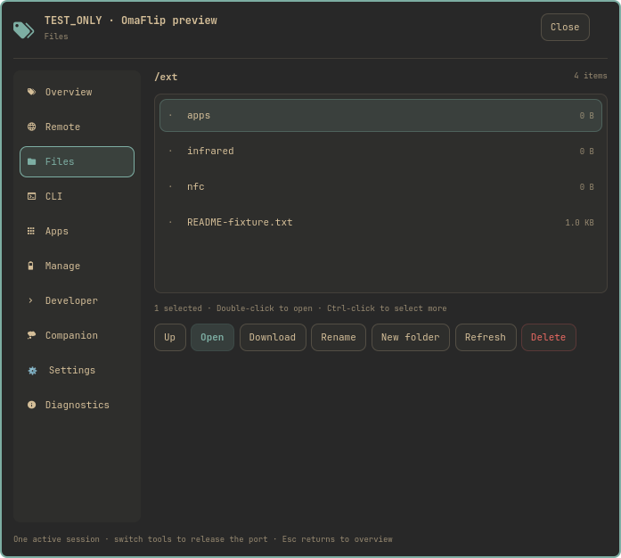
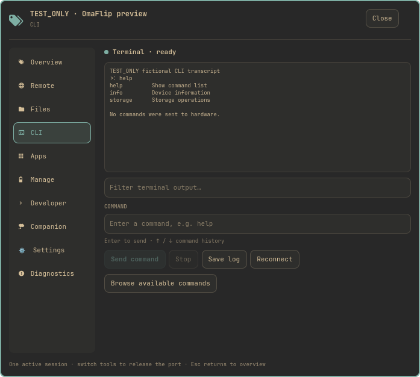
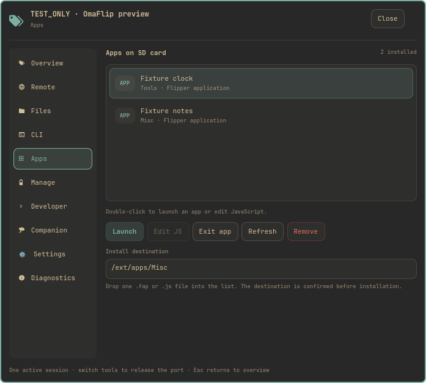
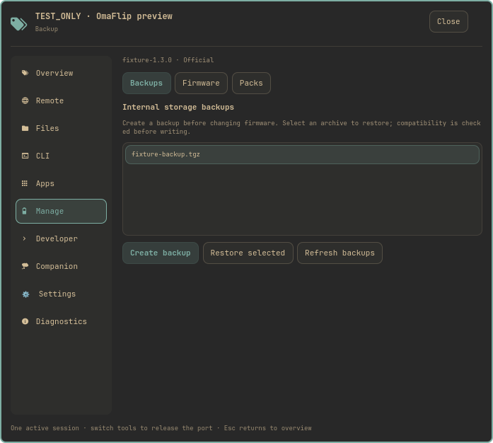
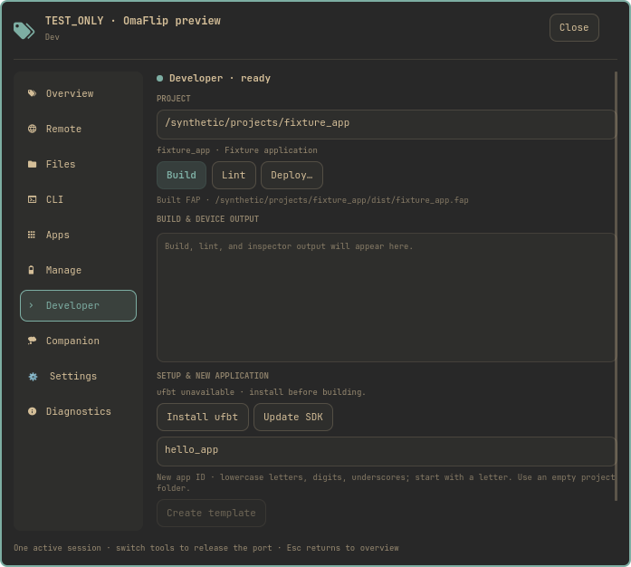
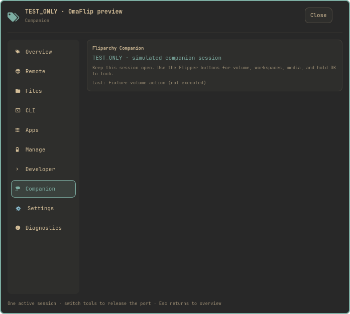

# OmaFlip

Native Flipper Zero management for the Omarchy Quattro bar: USB discovery,
remote screen, files, CLI, apps, backups, firmware, Dev, and optional
Fliparchy Companion.



Current redesigned UI captures. Remote is a real connected Momentum Flipper;
other previews use clearly labeled deterministic test fixtures, never production
fallback data. See `tests/ui/README.md` for capture provenance.

| Connected | Remote | Files |
| --- | --- | --- |
|  |  |  |

| CLI | Apps | Manage | Developer |
| --- | --- | --- | --- |
|  |  |  |  |



## Install

```sh
omarchy plugin add https://github.com/HowieDuhzit/OmaFlip.git --enable
```

The plugin ships QML plus a native `omaflip` backend. After adding it, build
once (nothing runs as root):

```sh
cd ~/.config/omarchy/plugins/io.github.howieduhzit.omaflip
./scripts/build
```

Then choose **Restart service** in the panel. Arch build packages:
`base-devel cmake qt6-base qt6-declarative systemd protobuf`.

The development installer copies a local checkout into the plugin directory and
**refuses to overwrite** an existing install:

```sh
./scripts/build
./scripts/install-dev
```

## Release archives

Source installation is the normal plugin path. The optional Linux x86_64 archive
also includes a backend built from the exact recorded source plus complete
buildable plugin sources. Inspect `RELEASE-MANIFEST.json`, `SOURCE-MANIFEST.json`,
`SBOM.spdx.json`, and `SHA256SUMS` before using it. Checksums verify integrity,
not independently authenticated trust. Read `INSTALL.txt` and do not overwrite
an unmanaged backend or locally modified plugin checkout. See
[release tooling](packaging/README.md) for build/verification commands and the
explicitly unclaimed bit-for-bit toolchain reproducibility boundary.

## Usage

Connect a Flipper Zero with a USB data cable. Click **OmaFlip** in the bar.
Use the persistent navigation to switch between Overview, Remote, Files, CLI,
Apps, Manage, Developer, Companion, Settings, and Diagnostics. On narrow screens,
navigation wraps above the workspace instead of squeezing the tool content.
Manage separates Backups, Firmware, and Packs into distinct tabs.

Tab moves focus between controls; Enter activates the focused control. In a tool,
arrows navigate its list or the remote D-pad, while text fields retain normal
editing keys. Escape cancels a pending confirmation first, then returns from a
tool to Overview; Escape on Overview closes the panel. The visible Close button
always closes the panel. Device sessions are exclusive and release the serial
port when switching tools or closing the panel.

Unavailable actions are disabled rather than silently doing nothing. Firmware,
restores, file removals, overwrites, and deployment retain explicit confirmations.
No firmware update or download runs automatically.

```sh
omarchy-shell shell summon io.github.howieduhzit.omaflip '{}'
omarchy-shell shell hide io.github.howieduhzit.omaflip
```

## Update

Close device operations first, then update the Git-managed installation:

```sh
omarchy plugin disable io.github.howieduhzit.omaflip
omarchy plugin update io.github.howieduhzit.omaflip --yes
cd ~/.config/omarchy/plugins/io.github.howieduhzit.omaflip
./scripts/build
omarchy plugin enable io.github.howieduhzit.omaflip
omarchy-restart-shell
```

Review the installed commit before enabling it: Omarchy updates to mutable
upstream HEAD, not an exact marketplace-reviewed SHA. Preserve a locally modified
checkout instead of overwriting it. Existing widget settings are retained.
Omarchy may cache nested QML at unchanged URLs after disable/enable or rescan;
restart the shell if the old layout remains visible. The restart briefly hides
bars and panels and respects the session-lock guard.

## Configure

```sh
omarchy bar move io.github.howieduhzit.omaflip --section right
```

Auto-connect, bar label, notify-on-connect, and notify-on-error persist in the
widget's Omarchy settings. They do not rewrite unrelated `shell.json` keys.

## Remove

```sh
omarchy plugin remove io.github.howieduhzit.omaflip --yes
```

Omarchy removes the plugin checkout and its bar entry. Optional leftovers:

```sh
rm -f ~/.local/lib/omaflip/omaflip
sudo rm -f /etc/udev/rules.d/70-omaflip.rules
sudo udevadm control --reload-rules
```

No firmware or Flipper files are changed.

## Features

- One native QML bar widget and keyboard-operated panel inside Omarchy's existing shell.
- One C++20 backend per user, owned by the plugin's service lifecycle.
- Startup discovery and libudev USB/TTY events; no device polling or idle timer.
- Flipper USB descriptor recognition, including firmware-customized product names,
  and `/dev/serial/by-id/` resolution.
- Multiple-device inventory and explicit device selection, remembered by USB identity.
- Separate disconnected, detecting, connecting, connected, busy, error, and bootloader states.
- Device name, firmware version/origin, hardware revision, USB serial, region,
  battery level, charging state, battery health, RPC protobuf version, and
  SD storage totals when firmware provides them.
- On-demand remote: 128×64 screen stream, directional/OK/Back input, mouse
  click/drag/wheel on the screen, PNG
  screenshot save/copy/history. The serial port is released when Remote closes.
- On-demand files: SD browse, text previews, download/upload with progress,
  drop destination review, mkdir/rename/delete, overwrite confirmation.
- On-demand CLI: firmware `help` command list, history, output filter, save,
  reconnect, bounded scrollback, and `log` streaming stopped with Ctrl+C.
- On-demand Apps: `/ext/apps` inventory, .fap launch/install/remove, JS
  edit/save/run through firmware JS Runner. No catalog client.
- On-demand Backup: `/int` archives with sidecar metadata, restore
  compatibility checks, official or Momentum firmware index + SHA-256
  download, confirmed SD updater apply. Asset packs install under
  `/ext/asset_packs`; activation is on-device. DFU flashing is not enabled.
- On-demand Dev: `ufbt` create/build/lint/SDK update, FAP deploy/run, and a
  read-only RPC inspector. `ufbt` is not bundled; GPIO/flash stay off.
- Optional Fliparchy Companion: selected-device desktop controls with fixed
  command allowlists, no arbitrary shell commands, and no automatic app install.
  Requires Fliparchy at `/ext/apps/Tools/fliparchy.fap`; see the Companion section.
- Clear permission/serial errors, Retry, Copy error, and bounded diagnostics.
- Native theme colors, fonts, spacing, panel transitions, and Escape dismissal.
- Desktop notifications for connect, disconnect, and errors (`device.added` /
  `device.removed` / `device.error`), with panel toggles. Probe and ping times
  in device details. Packaged tarball via `scripts/package`.
- Offline operation. No telemetry or automatic network requests. Firmware
  indexes are fetched only on an explicit Check.

Information is read at attachment and on **Refresh / Retry**. The serial port is
released after every query. **Last read (UTC)** identifies the snapshot; battery
and storage readings are not continuously refreshed. Missing fields show **Unavailable**.
Each refresh starts a short RPC session after the CLI reads, then releases the port.
Remote, Files, CLI, Apps, and Backup each hold the port only while that view is open.

## Requirements

- Omarchy with the Quattro plugin API (developed and tested on **4.0.4**).
- Linux with libudev and an active local logind session for `uaccess` permissions.
- Qt 6.6+ Core, Gui, and Network; Qt Test for the development tests.
- C++20 compiler, CMake 3.25+, pkg-config; `qmllint` for UI validation.
- A Flipper Zero and a USB data cable for device acceptance.

Arch packages: `base-devel cmake qt6-base qt6-declarative systemd protobuf`.
Python is used for development tests and release tooling. Core device management
requires no Python runtime; Developer tools may invoke Python-backed `ufbt`.
Qt SerialPort, Electron, a web server, and a second production Quickshell process
are not required. Native binary support is Linux x86_64 on the tested Omarchy
4.0.4/Qt 6.11.2 host; other architectures and running official firmware were
not verified in this release.

The plugin manifest has no build hook; adding the repository does not compile
`omaflip`. **Build / repair backend** in the panel opens `scripts/build` if the
binary is missing. See [development](docs/development.md) for iteration.

## Permissions / udev

If the device is present but inaccessible, the panel reports **Permission
denied**, including the actual port and suggested fix. Choose **Setup Device
Access**, review the prompt, and authenticate in the terminal. This installs
only `udev/70-omaflip.rules` and reloads udev rules. Unplug/reconnect afterward.

The rule grants the active local user access to the exact Flipper serial
descriptors. It does not make devices world-writable, add arbitrary groups, or
run the shell as root. Non-seat/headless sessions need their administrator's
device-access policy. DFU write permissions are deliberately not installed in
this release.

The optional udev rule is installed only when you choose **Setup Device Access**
and authenticate. Duplicate USB serials are never used to collapse devices.

## Firmware support

**Official firmware:** the foundation uses the upstream `device_info` and
`info power` CLI commands. Unsupported power commands leave power unavailable
without discarding valid device information. A firmware without a working CLI
is reported explicitly; USB presence does not prove a successful connection.

**Momentum:** USB recognition and CLI fields use the same foundation. Firmware
origin is shown exactly as reported; it is not guessed from a device name.
Updates use `https://up.momentum-fw.dev/firmware/directory.json` (release and
development). Asset packs use the documented `/ext/asset_packs` path and the
Momentum pack index; they are selected in Momentum Settings on the Flipper.
OmaFlip does not write Momentum settings files.

**Bootloader:** `0483:df11` is a shared STM32 DFU identity. OmaFlip lists it as
**STM32 DFU · identity unconfirmed**, never as a proven Flipper. It does not
flash, claim a serial-to-DFU identity mapping, or open arbitrary STM32 devices.

## Fliparchy Companion

Install the matching Fliparchy Flipper application separately at
`/ext/apps/Tools/fliparchy.fap`, then open Companion. OmaFlip does not fetch,
bundle, or install that executable automatically. Keep the session open to use
its desktop controls; switching tools or closing the panel releases the port.

The selected connected device can request allowlisted audio, media, workspace,
theme, background, nightlight, idle, notification-silencing, and desktop-lock
operations. Do not connect an untrusted device. This is local selected-device
trust, not cryptographic device authentication. Host dependencies are `omarchy`,
`hyprctl`, `playerctl`, and `wpctl`; missing commands must be treated as unavailable.
Lock testing is deliberately excluded from automated live-device acceptance.

## Developer Mode and FAP workflow

The foundation's diagnostics expose actual USB and firmware fields without a
mock layer. Dev uses upstream `ufbt` when it is on PATH (`pipx install ufbt` on Arch).
Deploy is OmaFlip RPC, not `ufbt flash`. See [roadmap](docs/roadmap.md).

## Troubleshooting

| Status | Action |
| --- | --- |
| No Flipper detected | Check the cable and USB mode; run `build/omaflip --scan` from the checkout. |
| Detecting | USB is present but a serial interface may not be ready, or auto-connect is off. |
| Permission denied | Install the supplied rule, then physically reconnect. |
| Busy | Close qFlipper or another serial client and Retry. |
| CLI timeout | Unlock/check firmware USB CLI support, close other clients, reconnect and Retry. |
| Service unavailable | Build the backend and Restart service; Open diagnostics shows stderr. |
| STM32 DFU | Confirm the device physically. This preview provides no recovery/flashing operation. |
| Third-party replacement bar | Omarchy intentionally withholds service lookup from widgets hosted by replacement bars; the trusted built-in bar is required. |

Diagnostics are bounded to 16 KiB and kept in memory. Device serials and paths
are shown locally; redact them before sharing bug reports. Another OmaFlip
backend cannot run concurrently in the same user session. Disabling/removing
the plugin closes its backend and any active serial transaction.

## Architecture and validation

[Architecture and IPC](docs/architecture.md) · [upstream research](docs/research.md)
· [validation record](docs/validation.md) · [third-party provenance](docs/third-party.md)
· [release tooling](packaging/README.md) · [contributing](CONTRIBUTING.md)

```sh
cmake -S . -B build -DBUILD_TESTING=ON
cmake --build build --parallel 2
ctest --test-dir build --output-on-failure
python tests/test_ipc.py
python tests/test_ui.py -v  # installed Omarchy + active Wayland display
omarchy plugin validate .
qmllint -I /usr/share/omarchy/shell BarWidget.qml Panel.qml Service.qml qml/*.qml
```

Unit tests use explicit pseudoterminal fixtures, isolated from production.
Hardware tests are a separate acceptance checklist. There is no runtime mock
switch and no generated fallback device information.

## Support and security

Report reproducible bugs at https://github.com/HowieDuhzit/OmaFlip/issues.
Redact USB serials, local paths, and unrelated desktop content. For suspected
security issues, use GitHub private vulnerability reporting when available;
otherwise contact the maintainer without posting credentials or exploit details.
Plugins run unsandboxed as your user. Marketplace checks are limited static
exact-commit evidence, not a security audit or safety guarantee.

## License

OmaFlip-authored code is MIT. OmaFlip is an independent project, not an official
Flipper Devices or Omarchy product. Upstream projects retain their licenses.
Unmodified pinned Flipper RPC definitions are vendored under `proto/`; their
licensing evidence and system-dependency boundaries are documented in
[third-party provenance](docs/third-party.md). Upstream firmware/qFlipper
application source and generated protobuf bindings are not vendored.
